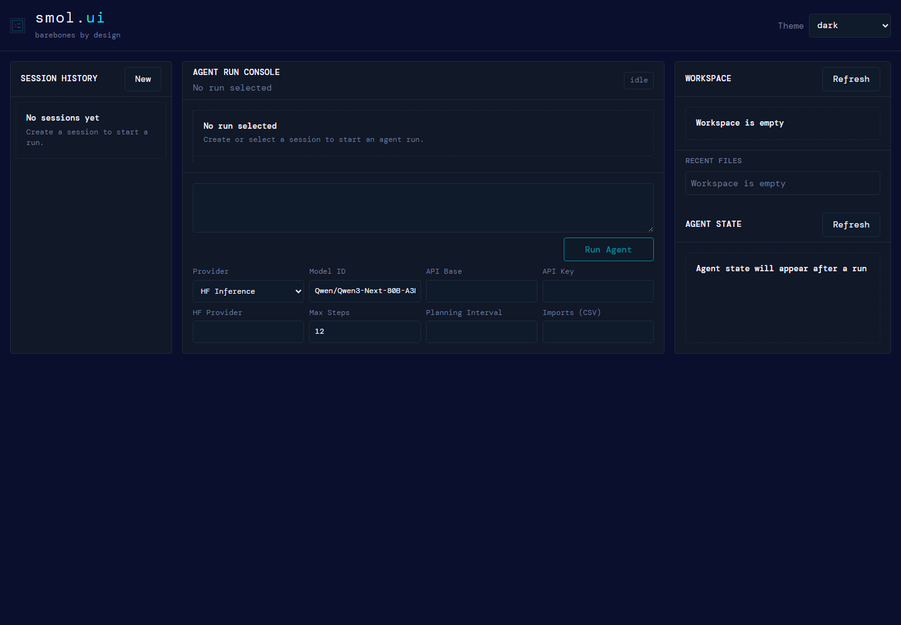

# smol.ui / smolagents-webui

Unofficial standalone WebUI for [Hugging Face smolagents](https://github.com/huggingface/smolagents).

`smolagents-webui` is a Python + vanilla JavaScript interface for running `smolagents` `CodeAgent` sessions from a browser. It provides session history, a streaming run timeline, tool/code/output cards, and a workspace/state panel.

Use your existing smolagents-compatible model/provider setup from the browser.



This project is not affiliated with, endorsed by, or maintained by Hugging Face.

## Install

From GitHub:

```bash
git clone https://github.com/electricwolfemarshmallowhypertext/smolagents-webui.git
cd smolagents-webui
pip install -e .
```

From a release wheel:

```bash
pip install smolagents_webui-0.1.0-py3-none-any.whl
```

`smolagents` is installed as a dependency. This repository does not bundle or redistribute the upstream `smolagents` Python package.

## Run

Use a dedicated workspace directory instead of the repo root:

```bash
mkdir -p ~/smol-ui-workspace ~/smol-ui-data
smolagents-webui \
  --workspace-root ~/smol-ui-workspace \
  --data-dir ~/smol-ui-data \
  --port 7865
```

PowerShell:

```powershell
mkdir .smol-ui-workspace
mkdir .smol-ui-data
smolagents-webui `
  --workspace-root .smol-ui-workspace `
  --data-dir .smol-ui-data `
  --port 7865
```

Open:

```text
http://127.0.0.1:7865
```

## Development

```bash
pip install -r constraints-dev.txt
pip install -e .
pytest tests/webui
```

Run without installing:

```bash
PYTHONPATH=src python -m smolagents_webui.server \
  --workspace-root ~/smol-ui-workspace \
  --data-dir ~/smol-ui-data \
  --port 7865
```

## Backends

Supported UI provider paths:

| Provider | smolagents adapter |
|---|---|
| HF Inference | `InferenceClientModel` |
| LiteLLM | `LiteLLMModel` |
| OpenAI | `OpenAIModel` |
| Ollama / OpenAI-compatible | `OpenAIModel` with custom `api_base` |

Tested release backend:

```text
Ollama via OpenAI-compatible API
model: qwen2.5-coder:7b
api_base: http://127.0.0.1:11434/v1
```

Ollama is tested, not required. Use any configured backend supported by the UI and your local credentials/environment.

## Using your own smolagents tools

Existing smolagents users can bring their own tools or agent setup into the WebUI at server start.

Tools factory:

```bash
smolagents-webui \
  --workspace-root ./workspace \
  --data-dir ./data \
  --tools-factory my_tools:get_tools
```

```python
# my_tools.py
def get_tools():
    return [my_tool_1, my_tool_2]
```

Agent factory:

```bash
smolagents-webui \
  --workspace-root ./workspace \
  --data-dir ./data \
  --agent-factory my_agent:create_agent
```

```python
# my_agent.py
from smolagents import CodeAgent


def create_agent(model):
    return CodeAgent(
        tools=[my_tool_1, my_tool_2],
        model=model,
        max_steps=10,
    )
```

The WebUI still creates the selected smolagents model adapter, then passes it to your factory so your configured tools can run through the browser. Tools factories are called with no arguments and must return a list. Agent factories may accept `model`, optionally `config`, and must return an agent with `.run()`.

Factories import and execute local Python code. Use only trusted local modules.

## Features

- Three-panel agent workbench: sessions, run timeline, workspace/state.
- Streaming cards for model output, tool calls, action steps, final answers, and errors.
- Persistent local session history.
- Workspace file tree and recent-files panel.
- Theme selector: `dark`, `light`, `modern-tech`.
- No frontend build step.

## Security

`smolagents` code agents can execute Python code and affect files in the configured workspace. Run this UI only against workspaces you are comfortable letting an agent read or modify.

This WebUI does not add an auth layer, sandbox, cloud sync, telemetry, or remote access control.

Local session history may store prompts, model outputs, generated code, tool observations, agent state, and errors. Do not use shared data directories for sensitive work. API keys are redacted before persistence.

Default localhost use is recommended. Do not bind to `0.0.0.0` or expose the server publicly unless it is behind trusted access controls.

## Verification

Current release receipts are tracked in:

```text
docs/AUDIT_RECEIPTS.md
docs/receipts/
```

Key verified gate:

```text
New session -> real smolagents CodeAgent.run() -> streaming events -> final answer -> persisted history
```

## License

`smolagents-webui` is licensed under the MIT License. See `LICENSE`.

`smolagents` is an Apache-2.0 licensed dependency by Hugging Face. See `NOTICE`.
